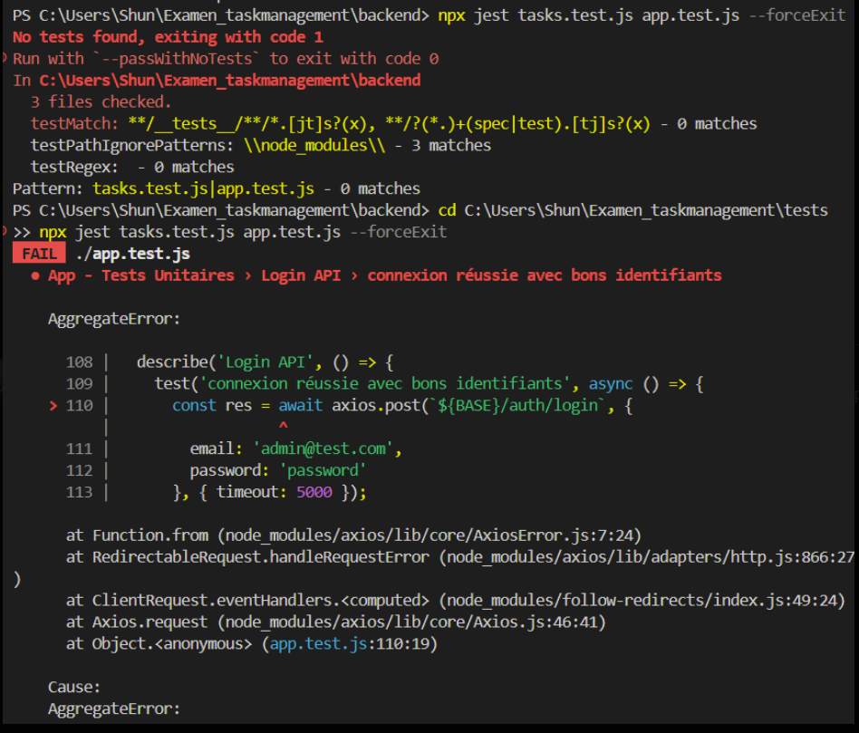
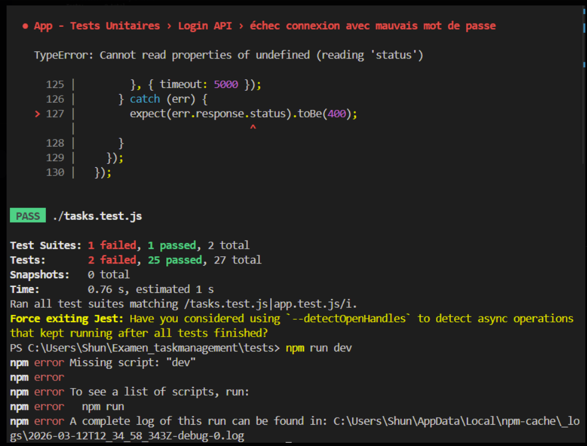
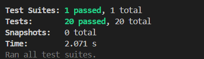

# partiel_outils_code

## Configuration et Organisation
1- Création du repo Git princial.

2- Ajout des autres collaborateurs.

3- Dans les paramètres du dépôt GitHub, nous avons configuré une règle de protection pour la branche main. Cette règle impose que toute modification destinée à être intégrée dans cette branche passe obligatoirement par une Pull Request.
De plus, chaque Pull Request doit être validée par au moins un reviewer avant de pouvoir être fusionnée.
Cette configuration permet de protéger la branche principale (main), considérée comme la branche de production, en garantissant une revue du code et en évitant les pushes directs.

## Développement Collaboratif

1- Création de l'arborescence : 

Examen_taskmanagement/
├── backend/
├── frontend/
├── tests/
├── README
└── .github/

## 2-Développement :
### Test unitaire

Pour les tests unitaires, on a utilisé Jest avec deux fichiers de tests : tasks.test.js et app.test.js.
Le fichier tasks.test.js a fonctionné sans problème, tous les tests passent correctement. Pour app.test.js, les tests de validation fonctionnent bien mais les tests qui appellent directement l'API ont échoué car on n'arrivait pas à accéder au backend depuis Jest au moment de l'exécution. En tout, 25 tests sur 27 passent. Le problème vient de la connexion au serveur et non du code en lui-même.

### Tests d’intégration

Des tests d’intégration ont été implémentés avec Jest et Supertest afin de vérifier le bon fonctionnement de l’API REST.
Ces tests simulent des requêtes HTTP vers le serveur Express et permettent de valider les réponses retournées par l’application.

- Les scénarios testés incluent :

- vérification de l’état du serveur (/health)

- authentification utilisateur (login et register)

- accès sécurisé aux routes avec token JWT

- opérations CRUD sur les tâches

- validation des erreurs (token manquant, token invalide,    tâche inexistante)

- récupération des utilisateurs sans exposition du mot de passe

- gestion des routes inconnues

- Au total 20 tests d’intégration ont été exécutés avec succès.

### Tests E2E avec Selenium
Les tests E2E ont été réalisés avec Selenium WebDriver sur Microsoft Edge, répartis en deux fichiers : login.e2e.test.js (affichage du formulaire, connexion réussie, mauvais mot de passe, champs vides) et tasks.e2e.test.js (ouverture de la modale, création d'une tâche, priorité haute, annulation, déconnexion).
La mise en place a nécessité plusieurs ajustements : téléchargement manuel du EdgeDriver en version correspondant à celle d'Edge, correction des sélecteurs CSS (attributs type et name plutôt que placeholder), ajout d'attentes explicites pour laisser React rendre les composants, et ciblage précis du bouton de soumission dans la modale pour éviter les conflits avec le bouton du dashboard.

